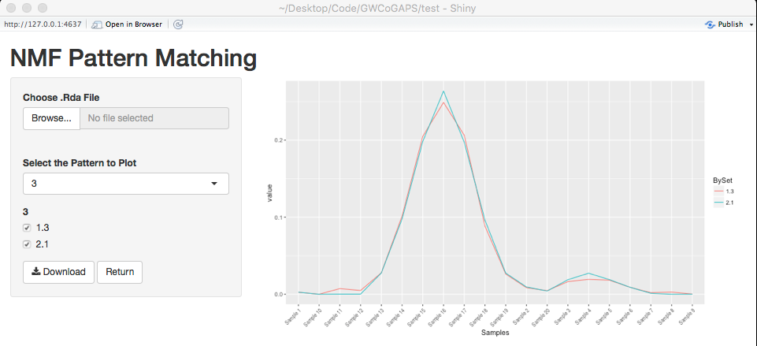

```{r include=FALSE, cache=FALSE}
library(CoGAPS)
```

# Introduction

NMF algorithms associate gene expression changes with biological processes
(e.g., time-course dynamics or disease subtypes). Compared with univariate
gene associations, the relative gene weights of NMF solutions do not clearly
identify gene biomarkers for these processes. Therefore, we developed a novel
PatternMarkers statistic to extract genes uniquely representative of NMF
patterns for enhanced visualization and subsequent biological validation.
Finding unbiased gene markers with PatternMarkers requires whole-genome data.
However, NMF algorithms typically do not converge for the tens of thousands of
genes in genome-wide profiling. Therefore, we also developed GWCoGAPS to
simultaneously cut runtime and ensure convergence for whole genome NMF with a
sparse, MCMC NMF algorithm CoGAPS. The software includes a shiny application
PatternMatcher to compare NMF patterns. 

# GWCoGAPS

In this chapter, we describe how to run both the GWCoGAPS algorithm and a
manual pipeline for genome wide NMF analysis.

## Running GWCoGAPS

Before calling *GWCoGAPS*, the user must partition the data into random subsets
of genes. In this example we use the sample data provided in the package.

```{r}
data(SimpSim)
simulationName <- createGWCoGAPSSets(SimpSim.D, SimpSim.S, nSets=2, "example")
```

This will break up our data into 2 separate *.RData* files which we will pass
to *GWCoGAPS* by providing the *simulationName* parameter of
*createGWCoGAPSSets*.

```{r}
result <- GWCoGAPS(simulationName, nFactor=3, nEquil=500, nSample=500,
    nOutput=250)
```

Note that *nFactor* is required by *GWCoGAPS* but *nEquil* and *nSample* are
optional. Any parameters passed in the ... argument of *GWCoGAPS* will be 
forwarded to the internal call to *CoGAPS*.

There are additional optional parameters that can be passed to *GWCoGAPS*:

*nCores* - number of cores for parallelization, if not set then
  nCores = nSets  
*cut* - number of branches at which to cut dendrogram used in 
    *patternMatch4Parallel*  
*minNS* - minimum of individual set contributions a cluster must contain used
    in *patternMatch4Parallel*  
*manualMatch* - logical indicating whether or not to stop after initial phase
    for manual pattern matching  
*consensusPatterns* - fixed pattern matrix to be used to ensure reciprocity of
    A weights accross sets  

Once the GWCoGAPS algorithm has been run, the inferred patterns and
corresponding amplitudes can processed in the same way as output from CoGAPS.

```{r}
plotGAPS(result$Amean, result$Pmean)
```

## PatternMatcher Shiny App

The PatternMatcher Shiny App can be used to compare patterns across parallel
runs to increase robustness and interpretability of the patterns resulting
from Genome-Wide CoGAPS Analysis in Parallel Sets. In this vignette, we will
focus on patterns generated from gene expression analysis using GWCoGAPS, but
the PatternMatcher Shiny App is applicable more broadly. Any list of related
patterns can be input to PatternMatcher for visualization and similar
analyses. Custom sets can be matched using the patternMatch4Parallel function
as described in manual pipeline outlined in the following section.  

The input for this function are:

*PBySet* - list of matched set solutions for the Pmatrix from an NMF
    algorithm  
*out* - optional name for saving output  
*order* - optional vector indicating order of samples for plotting. Default is
    NULL, note: this should only be passed in an interactive R session  
*sample.color* - optional vector of colors of same length as colnames. Default
    is NULL, note: this should only be passed in an interactive R session  



# PatternMarkers

The PatternMarkers statistic extracts genes representative of NMF patterns for
enhanced visualization and subsequent biological validation. While first
developed for CoGAPS and other NMF algorithsm, PatternMarkers can be used to
find unique markers for any patterns associated with sets of continuous
relative weights. 

## PatternMarkers

The PatternMarkers statistic finds the genes most uniquely associated with a
given pattern or linear combination of patterns by computing

\begin{equation}
\sqrt{\left(\bf{A}_{i}-l_{p}\right)^{\textit{t}} \left(\bf{A}_{i}-l_{p}\right)}
\label{eq:PatternMarkers}
\end{equation}

where  are the elements of the $\bf{A}$ matrix for the $\textit{i}^{th}$ gene
scaled to have a maximum of one and \textit{l} is the $\textit{p}^{th}$ user
specified norm. The genes are then ranked. In the case where \textit{l} is the
identity vector, the ranking is run separately for each of the K patterns.
Unique sets are generated by grouping each gene by lowest ranking pattern or
thresholding using the first gene to have a lower ranking, i.e. better fit to,
another patterns.

### Methods

The PatternMarkers statistic is run by calling the *patternMarkers* function. 
The arguments for the function are,

*Amatrix* - A matrix of genes by weights resulting from CoGAPS or other NMF
    decomposition  
*scaledPmatrix* - logical indicating whether the corresponding pattern matrix
    was fixed to have max 1 during decomposition  
*Pmatrix* - the corresponding Pmatrix (patterns X samples) for the provided
    Amatrix (genes x patterns). This must be supplied if scaledPmatrix is FALSE.  
*threshold* - The default "All" will distribute genes into pattern with the
    highest ranking. The "cut" thresholding by the first gene to have a lower
    ranking, i.e. better fit to, a pattern.  
*lp* - a vector of weights for each pattern to be used for finding markers.
    If NA markers for each pattern of the A matrix will be used.  
*full* - logical indicating whether to return the ranks of each gene for each
    pattern  

Once the PatternMarkers statistic has been run, a heatmap of each markers
expression level can be displayed using the *plotPatternMarkers* function.

# Feedback

Please send feedback to Genevieve L. Stein-O'Brien  
gsteinobrien@jhmi.edu

# References


